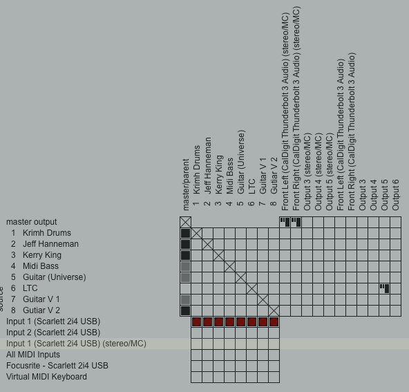

# Record Three HDMI Video sources and one Audio Source to SSD

## Synchronization

Reaper will send LTC information to the ATEM’s recording on the SSD. When you edit the video later with Da Vinci Resolve that LTC information can be used to align what you see and hear. Each time you record a performance follow this workflow:

**Press Record on ATEM first**

* ATEM begins recording:
* Video ISOs (camera inputs as HDMI).
* Audio ISOs (including ATEM Mic 1 with LTC input).
* If Reaper isn’t running yet, the LTC track is either silent or just starts later once Reaper begins sending it.

**Press Record in Reaper second**

* Reaper begins outputting **LTC** from the audio interface outputs 3/4 (dedicated to LTE)
* ATEM is already recording, so it captures the LTC signal as soon as it starts.
* Reaper is capturing the actual audio from the microphones which will be exported later as a wav file as the actual sound track for the Resolve video project.

During post processing, Resolve can be made to see the LTC start, it **decodes the timestamp** (e.g. 00:00:03:12, frame-accurate), and uses it to align the Reaper `.wav` file with the ATEM video timeline.

## Connections

### ATEM Mini Pro ISO

#### Inputs

1. HDMI 1: Camera 1
2. HDMI 2: Camera 2
3. HDMI 2: Camera 3
4. Mic 1: 3.5 mm input from channel 3/4 RCA outputs of Focus Rite Scarlett 2i4 (2nd gen)

#### Outputs

* HDMI out to Monitor
* USB-C to SSD (Samsung T7) for recording
* Ethernet to Hub (software control) – only for initial configuration

## Cameras

All cameras are configured in clean HDMI mode

[AVKANS 4K Camera, WiFi NDI Sport Action Camera](https://www.amazon.com/dp/B097T584GK) (x3)
 1. Plug in USB-C power and Micro HDMI to HDMI
 2. Plug HDMI out into ATEM
 3. Start AVKANS App and pair camera over WiFi
 4. Change output resolution from 2160P to 1080P in the AVKANS app
 5. Camera output should appear on preview screen

## ATEM Software

These Settings should only need to be made once. I.e. you should not
need the connect the Ethernet for subsequent recordings.

### Video

1. In the ATEM Software \> Gear \> General \> Video \> 1080p30

The p30 is from the the AVKANS Go’s *native output frame rate is 30* fps

### Audio

Open **ATEM Software Control → Audio tab**.

Find Mic 1 (where your Scarlett LTC is connected).

- Set it to ON.
- Leave the fader at 0 dB (unity).
- Do not apply EQ or dynamics on this channel.
- Do not set it to OFF.
- Do not use AFV.

Mic carrying LTC must be ON at record start.

The HDMI cable connecting the ATEM to the Monitor to see video might
also play the LTC noise which you do not want to hear. So turn the
master audio fader down to zero.

This ensures LTC is recorded into the ATEM ISO WAV files so it can be decoded later.

Click the Gear Icon in the bottom left \> select General \> select Line (not Microphone)

Make sure Reaper is always running when you record on the ATEM, otherwise you’ll just capture silence in that track.

#### Optional Backup Audio

The **Mic 2** input can be used to capture audio from the performance
with either a microphone in the room for drums or if guitar is being
recorded, I use the thru output of my J48 direct box. This second wav
file can be useful for a reference if you need to sync manually.

## Use Reaper as Time Source

Create an LTC Track

1. Insert a new track called LTC into your project to contain the timecode.
2. Go to the Insert menu in the top navigation bar.
3. Select "SMPTE LTC/MTC Timecode Generator" from the dropdown list. This will create a new item on your selected track.
4. Extend the timecode to the end of the project by dragging its right edge in the timeline.
5. Edit the properties by double-clicking the new timecode item. This will open the Media Item Properties window.
6. Click the "Properties" button in the lower-left of the window to access the SMPTE Generator Properties. 
7. Set the start time to 00:00:00:00
8. Set the Frame rate to 30
 - This is native to the Avkans Go
 - In the ATEM Software \> Gear \> General \> Video \> 1080p30
9. Optional: Right click the track and lock it

Route the LTC Track

1. Ensure LTC is not selected under master/parent 
2. Select LTC under Output 5 (so it sends to the ATEM)
 - Core Audio renumbered the 3/4 output on the Scarlett as output 5/6
3. See [ChatGPT discussion](https://chatgpt.com/share/69514e1d-3738-8013-bbdd-addc2df41989) and [Scarlett2i42ndGenManual](https://fael-downloads-prod.focusrite.com/customer/prod/downloads/Scarlett%202i4%202nd%20Gen%20User%20Guide%20v1.1%20English%20-%20EN.pdf) (page 17\)



This must be done per project but copying/pasting the track between projects can save time. 

### LTC mono vs stereo

In the routing matrix image:

- Track 6 = LTC
- Output 5 (mono) is checked
- Output 6 is not checked
- Output 5/6 together form a stereo pair at the interface level

That means:

- LTC is being sent only to Output 5
- When recorded as "stereo", it lands on one side only
- in my case, the RIGHT channel

Per ChatGPT we do no want stereo LTC.

If you send LTC to both:
- You’ll get dual-mono LTC (same signal both channels)
- That can work, but it’s worse practice
- Some LTC decoders will misbehave if both channels contain phase-identical LTC
- It also makes it easier for processing/mixing to damage the signal


## Record

### Record to SSD

In the ATEM Controller Software: Record \> ISO Record All Inputs (should be checked).

Press the REC button so start and STOP to stop. It should be red during recording.

### Export from SSD

After recording unplug the SSD from the ATEM and plug it directly into a Mac. Copy the file “Untitled” to the hard drive. In my case I saved it in /Users/fultonj/Movies/AtemDay2/Untitled

Go there with the terminal and bring in the rendered file from Reaper (e.g. PostmortemIntro.wav). The structure should look like this:

```
[fultonj@jove Untitled]$ tree
.
├── Audio Source Files
│ ├── Untitled CAM 1 01.wav
│ ├── Untitled CAM 2 01.wav
│ ├── Untitled CAM 3 01.wav
│ ├── Untitled MIC 1 01.wav
│ └── Untitled MIC 2 01.wav
├── PostmortemIntro.wav
├── Untitled 01.mp4
├── Untitled.drp
└── Video ISO Files
├── Untitled CAM 1 01.mp4
├── Untitled CAM 2 01.mp4
└── Untitled CAM 3 01.mp4

2 directories, 14 files
[fultonj@jove Untitled]$
```

Next delete all audio source files except “Untitled MIC 1 01.wav” as well as delete “Untitled CAM 3 01.mp4” as I am not using camera 4.

```
[fultonj@jove Audio Source Files]$ ll
total 122320
-rwx------1 fultonjstaff12M Dec 28 15:07 Untitled MIC 2 01.wav
-rwx------1 fultonjstaff12M Dec 28 15:07 Untitled MIC 1 01.wav
-rwx------1 fultonjstaff12M Dec 28 15:07 Untitled CAM 3 01.wav
-rwx------1 fultonjstaff12M Dec 28 15:07 Untitled CAM 2 01.wav
-rwx------1 fultonjstaff12M Dec 28 15:07 Untitled CAM 1 01.wav
[fultonj@jove Audio Source Files]$ mv Untitled MIC\ 1\ 01.wav ..
[fultonj@jove Audio Source Files]$ cd ..
[fultonj@jove Untitled]$ pwd
/Users/fultonj/Movies/AtemDay2/Untitled
[fultonj@jove Untitled]$ rm -rf Audio Source\ Files/
[fultonj@jove Untitled]$ rm Video\ ISO\ Files/Untitled\ CAM\ 4\ 01.mp4
[fultonj@jove Untitled]$
```

## Use LTC data to timestamp sources at the appropriate offset

First we confirm "Untitled MIC 1 01.wav" has the LTC codes. Ensure you have ltcdump (`brew install ltc-tools`).

```
[fultonj@jove Untitled]$ ltcdump -f 30 "Untitled MIC 1 01.wav" | head
Note: This is not a mono audio file - using channel 1
#User bitsTimecode |Pos. (samples)
#DISCONTINUITY
00000000 00:00:00:01 | 115958 117557
00000000 00:00:00:02 | 117558 119157
00000000 00:00:00:03 | 119158 120757
00000000 00:00:00:04 | 120758 122357
00000000 00:00:00:05 | 122358 123957
00000000 00:00:00:06 | 123958 125557
00000000 00:00:00:07 | 125558 127157
00000000 00:00:00:08 | 127158 128757
[fultonj@jove Untitled]$
```
The `-f` value is 30 Frames per Second (FPS) since that is native to the AVKANS Go.

What this output proves:

* #DISCONTINUITY --> this is the first valid LTC frame in the file.
* First frame is 00:00:00:01 at sample 115,958.
* LTC is being decoded correctly at 30 fps non-drop.

Compute the offset (30 fps, 48 kHz)

* Samples = 115,958
* Sample rate = 48,000 Hz
* Seconds = 115,958 ÷ 48,000 ≈ 2.416 s

At 30 fps:

* Frames = 2.416 × 30 ≈ 72.5 frames
* That corresponds to 00:00:02:13 (2 seconds + 13 frames, rounded)

So the correct audio start timecode is 00:00:02:13

Next we stamp Video files with the Timecodes from the above file. They're already synchronized from being made at the same time so we can stamp them without any offset. 

```
[fultonj@jove Video ISO Files]$ pwd
/Users/fultonj/Movies/AtemDay2/Untitled/Video ISO Files
[fultonj@jove Video ISO Files]$ for i in 1 2 3; do
ffmpeg -i "Untitled CAM $i 01.mp4" -c copy -timecode 00:00:00:01 "CAM${i}_tc.mp4"
done
ffmpeg version 7.1.1 Copyright (c) 2000-2025 the FFmpeg developers
built with Apple clang version 16.0.0 (clang-1600.0.26.6)
…
[fultonj@jove Video ISO Files]$ ll
total 2829336
-rwx------1 fultonjstaff 230M Dec 28 15:07 Untitled CAM 3 01.mp4
-rwx------1 fultonjstaff 234M Dec 28 15:07 Untitled CAM 2 01.mp4
-rwx------1 fultonjstaff 227M Dec 28 15:07 Untitled CAM 1 01.mp4
-rw-r--r--@ 1 fultonjstaff 227M Dec 28 15:37 CAM1_tc.mp4
-rw-r--r--@ 1 fultonjstaff 234M Dec 28 15:37 CAM2_tc.mp4
-rw-r--r--@ 1 fultonjstaff 230M Dec 28 15:37 CAM3_tc.mp4
[fultonj@jove Video ISO Files]$
```
Create the time-coded audio MOV

In `/Users/fultonj/Movies/AtemDay2/Untitled` run:

```
ffmpeg -f lavfi -r 30 \
-t $(ffprobe -v error -show_entries format=duration -of default=nk=1:nw=1 "PostmortemIntro.wav") \
-i "color=size=16x16:color=black" \
-i "PostmortemIntro.wav" \
-shortest -c:v prores -profile:v 3 -c:a copy \
-timecode 00:00:02:13 \
"PostmortemIntro_tc.mov"
```

Verify every file we will import into Resolve has the correct embedded start timecode.

```
[fultonj@jove Untitled]$ for f in Video\ ISO\ Files/CAM*\_tc.mp4 PostmortemIntro_tc.mov; do
echo "$f"
ffprobe \-v error -select_streams v:0 \
-show_entries stream_tags=timecode \
-of default=nw=1 "$f"
done
Video ISO Files/CAM1_tc.mp4
TAG:timecode=00:00:00:01
Video ISO Files/CAM2_tc.mp4
TAG:timecode=00:00:00:01
Video ISO Files/CAM3_tc.mp4
TAG:timecode=00:00:00:01
PostmortemIntro_tc.mov
TAG:timecode=00:00:02:13
[fultonj@jove Untitled]$
```

The following files are now ready for import into Resolve

1. Video ISO Files/CAM1_tc.mp4
2. Video ISO Files/CAM2_tc.mp4
3. Video ISO Files/CAM3_tc.mp4
4. PostmortemIntro_tc.mov
